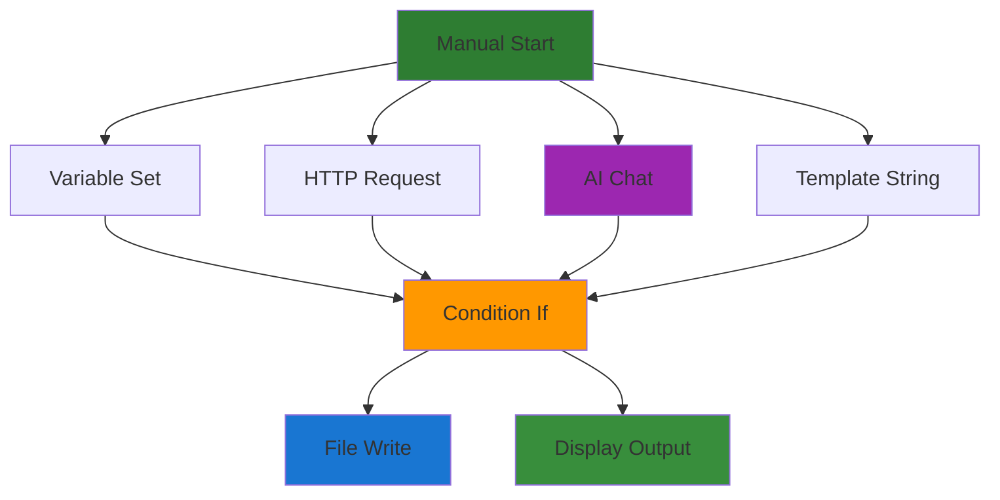

# V2 MVP Scope: Bulletproof Desktop Foundation

## Core MVP Philosophy

This V2 MVP combines **Claude's KISS principles** with **Codex's extensible architecture** and **Gemini's pragmatic feature set**. The goal is to ship a bulletproof desktop application that is simple enough to be reliable but architected to grow sustainably.

## Success Criteria

### Functional Requirements
✅ **Canvas Workflow Creation**: User can visually create workflows with drag-and-drop blocks
✅ **Workflow Execution**: Sequential execution with real-time progress feedback
✅ **AI Integration**: Direct integration with OpenAI, Anthropic, and local Ollama
✅ **Local Storage**: All data stored locally in SQLite with no external dependencies
✅ **Settings Management**: Secure API key storage and basic application configuration

### Technical Requirements
✅ **Zero Configuration**: App works immediately after installation
✅ **Cross-Platform**: Runs on Windows, macOS, and Linux
✅ **Offline Capable**: Works without internet (except for cloud AI calls)
✅ **Fast Startup**: < 3 seconds from launch to usable interface
✅ **Reliable**: No crashes, data loss, or corrupt states during normal operation

### User Experience Requirements
✅ **Intuitive Interface**: Users can create their first workflow within 5 minutes
✅ **Clear Feedback**: Every action provides immediate visual feedback
✅ **Error Recovery**: Graceful handling of network failures, invalid inputs, and API errors
✅ **Documentation**: Built-in help and examples for each block type

## Core Block Catalog

### Essential Block Types (MVP)



#### 1. Control Flow Blocks

**manual.start**
- **Purpose**: Workflow entry point for user-triggered execution
- **Inputs**: Optional JSON data input
- **Outputs**: Pass-through data
- **Use Case**: Starting point for all manual workflows

**condition.if**
- **Purpose**: Conditional branching based on template expressions
- **Inputs**: Condition template, input data
- **Outputs**: Boolean result, pass-through data
- **Use Case**: Route workflow based on data conditions

#### 2. Data Manipulation Blocks

**variable.set**
- **Purpose**: Store values in workflow context for later use
- **Inputs**: Variable name, value (any type)
- **Outputs**: Stored value
- **Use Case**: Intermediate data storage and sharing

**template.string**
- **Purpose**: Create formatted strings using workflow variables
- **Inputs**: Template string with {{variable}} syntax
- **Outputs**: Formatted string
- **Use Case**: Dynamic text generation and formatting

#### 3. Network Blocks

**http.request**
- **Purpose**: Make HTTP requests to external APIs
- **Inputs**: URL, method, headers, body
- **Outputs**: Status code, response headers, response body
- **Use Case**: API integration and data fetching

#### 4. AI Blocks

**ai.chat**
- **Purpose**: Send prompts to AI providers and get responses
- **Inputs**: Prompt template, system prompt, input data
- **Outputs**: AI response text, token usage statistics
- **Config**: Provider, model, temperature, max_tokens
- **Use Case**: AI-powered text generation and analysis

#### 5. I/O Blocks

**file.write**
- **Purpose**: Write data to local filesystem
- **Inputs**: File path, content, format (text/json)
- **Outputs**: File path, success status
- **Use Case**: Save workflow results to disk

**output.display**
- **Purpose**: Display final workflow results to user
- **Inputs**: Content to display, format (text/json/html)
- **Outputs**: None (terminal block)
- **Use Case**: Show workflow results in UI

## Example Workflows (MVP Validation)

### 1. API Data Analysis
```
manual.start (API endpoint)
→ http.request (fetch data)
→ ai.chat (analyze data with GPT-4)
→ template.string (format report)
→ file.write (save analysis)
→ output.display (show summary)
```

### 2. Content Generation
```
manual.start (topic input)
→ template.string (create detailed prompt)
→ ai.chat (generate content)
→ condition.if (check content length)
→ [if too short] ai.chat (expand content)
→ [else] file.write (save content)
→ output.display (show final content)
```

### 3. Data Processing Pipeline
```
manual.start (data source)
→ http.request (fetch raw data)
→ variable.set (store for processing)
→ ai.chat (extract insights)
→ template.string (format results)
→ file.write (save processed data)
→ output.display (show summary)
```

## MVP Feature Boundaries

### ✅ Included in MVP

**Core Functionality:**
- Visual workflow editor with drag-and-drop
- Sequential block execution with progress tracking
- Local SQLite database with automatic backups
- Secure API key management with Stronghold
- Real-time AI streaming responses
- File import/export for workflows
- Basic error handling and recovery

**User Interface:**
- Infinite canvas with pan/zoom
- Block palette with search
- Property inspector for block configuration
- Execution logs and results viewer
- Settings panel for API keys and preferences

**AI Integration:**
- OpenAI provider (GPT-3.5, GPT-4)
- Anthropic provider (Claude 3 family)
- Ollama provider (local models)
- Streaming response support
- Token usage tracking

**Data Management:**
- Workflow CRUD operations
- Execution history with summaries
- Application settings persistence
- Local file operations (read/write)

### ❌ Explicitly Excluded from MVP

**Advanced Workflow Features:**
- Loops and iteration
- Parallel execution
- Sub-workflows and nesting
- Scheduled execution
- Background job processing

**Collaboration Features:**
- Multi-user workflows
- Real-time collaboration
- Workflow sharing and publishing
- Comment and annotation system
- Version control integration

**Advanced Integrations:**
- OAuth-based integrations (Google, Microsoft, etc.)
- Database connectors (MySQL, PostgreSQL)
- Complex third-party services
- Webhook triggers
- Email/SMS notifications

**Enterprise Features:**
- User management and authentication
- Role-based permissions
- Audit logging
- SAML/SSO integration
- Multi-tenant architecture

**Advanced AI Features:**
- Fine-tuning and custom models
- Vector databases and embeddings
- Function calling and tool use
- Image and document processing
- Voice and speech integration

## Technical Architecture Constraints

### Performance Targets
- **Startup Time**: < 3 seconds cold start
- **Workflow Save**: < 100ms for typical workflow
- **Workflow Load**: < 200ms including UI rendering
- **Canvas Responsiveness**: 60fps interactions at any zoom level
- **AI Response Latency**: < 500ms overhead (excluding provider time)

### Resource Constraints
- **Memory Usage**: < 100MB for typical workflows (< 50 blocks)
- **Disk Usage**: < 500MB total application size
- **Network Usage**: Only for AI API calls, no telemetry
- **CPU Usage**: < 5% when idle, reasonable during execution

### Security Requirements
- **API Keys**: Encrypted at rest with Stronghold
- **Local Data**: SQLite database with file-level encryption
- **Network**: HTTPS only, certificate validation
- **Code**: No remote code execution, sandboxed file access

## Validation Scenarios

### User Acceptance Tests

**Test 1: New User Onboarding**
1. User installs application
2. User opens application (should take < 3 seconds)
3. User sees welcome screen with example workflow
4. User creates their first workflow within 5 minutes
5. User successfully executes workflow and sees results

**Test 2: AI Integration Setup**
1. User navigates to settings
2. User adds OpenAI API key
3. User creates workflow with AI block
4. User configures AI block with prompt
5. User executes workflow and receives AI response

**Test 3: Workflow Persistence**
1. User creates complex workflow (5+ blocks)
2. User saves workflow with descriptive name
3. User closes application
4. User reopens application
5. User loads saved workflow (all blocks and connections intact)

**Test 4: Error Recovery**
1. User creates workflow with invalid HTTP URL
2. User executes workflow
3. Application shows clear error message
4. User fixes URL and re-executes
5. Workflow completes successfully

**Test 5: Performance Validation**
1. User creates large workflow (20+ blocks)
2. Canvas remains responsive during creation
3. Workflow executes without blocking UI
4. User can interact with other parts of application during execution

### Technical Validation Tests

**Load Testing:**
- 50+ blocks in single workflow
- 100+ saved workflows in database
- 10+ concurrent AI API calls
- Large file operations (1MB+ files)

**Cross-Platform Testing:**
- Windows 10/11 (x64)
- macOS 12+ (Intel and Apple Silicon)
- Ubuntu 20.04+ (x64)

**Network Resilience:**
- Offline operation (local model only)
- Slow network conditions
- Network interruption during AI calls
- Invalid SSL certificates

## Success Metrics

### Quantitative Metrics
- **Time to First Workflow**: < 5 minutes for new users
- **Crash Rate**: < 0.1% of sessions
- **Data Loss Rate**: 0% under normal operation
- **User Retention**: > 70% return within 7 days
- **Performance**: 90th percentile startup time < 3 seconds

### Qualitative Metrics
- **User Feedback**: Average rating > 4.0/5.0
- **Support Requests**: < 10% of users need help with basic operations
- **Feature Requests**: Clear indication of next priority features
- **Bug Reports**: < 5 critical bugs per 1000 users per month

## MVP Delivery Timeline

### Phase 1: Foundation (Weeks 1-3)
- Tauri project setup and basic window
- SQLite database with core schema
- Canvas implementation with basic rendering
- Simple block placement and connection

### Phase 2: Core Blocks (Weeks 4-6)
- Block registry and descriptor system
- Implementation of all 6 core block types
- Basic execution engine with sequential processing
- Configuration UI for all block types

### Phase 3: AI Integration (Weeks 7-9)
- AI provider trait system
- OpenAI and Anthropic implementations
- Secure key management with Stronghold
- Streaming response handling

### Phase 4: Polish and Testing (Weeks 10-12)
- Local Ollama integration
- Comprehensive error handling
- Performance optimization
- Cross-platform testing and packaging

## Risk Mitigation

### Technical Risks
- **Canvas Performance**: Regular profiling and optimization checkpoints
- **AI Provider Changes**: Abstraction layer protects against API changes
- **Cross-Platform Issues**: Early testing on all target platforms
- **Data Corruption**: Comprehensive backup and recovery testing

### User Experience Risks
- **Learning Curve**: Built-in tutorials and example workflows
- **Error Messages**: User-friendly error descriptions with suggested fixes
- **Performance Expectations**: Clear feedback during long operations
- **Feature Gaps**: Focus communication on MVP scope and future roadmap

This V2 MVP scope provides a clear, achievable target that delivers real user value while establishing a solid foundation for future growth. The focus on bulletproof reliability and extensible architecture ensures the MVP can evolve into a full-featured desktop application.